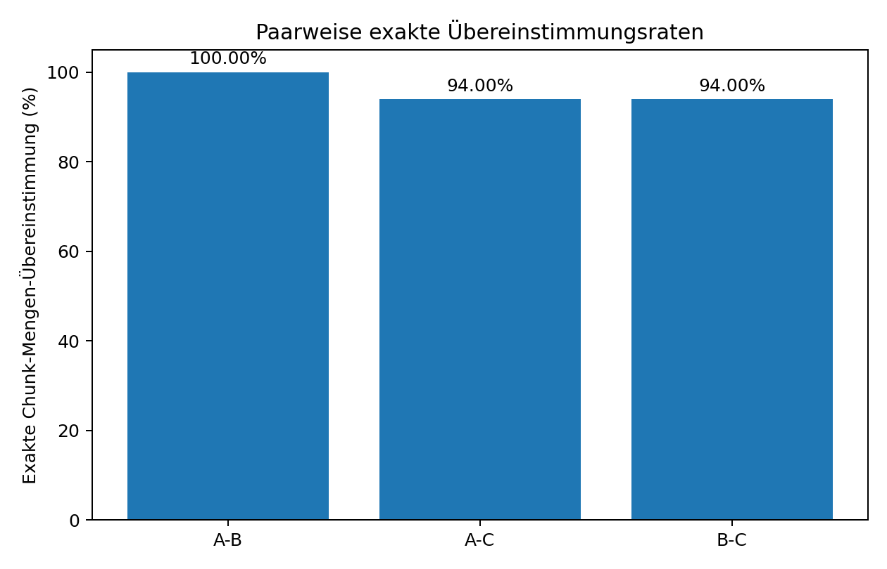
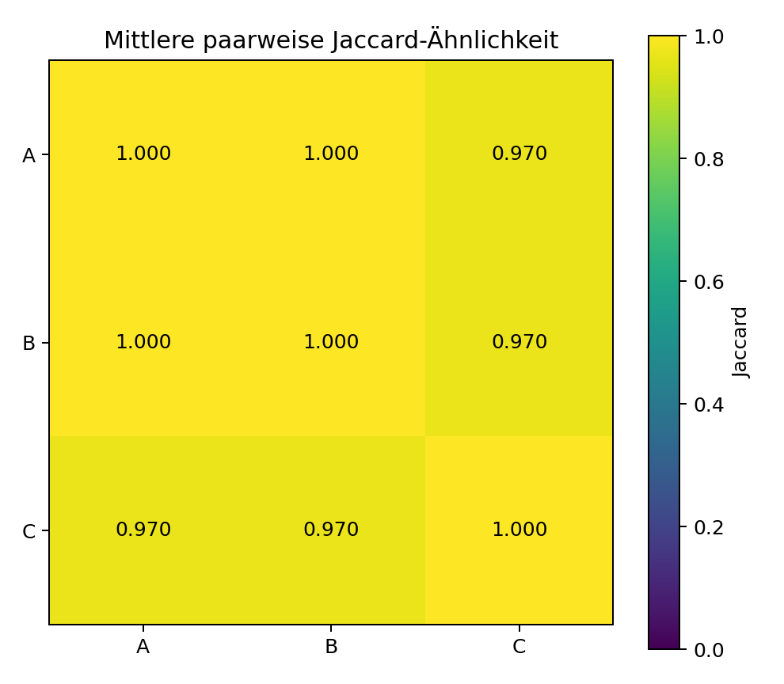
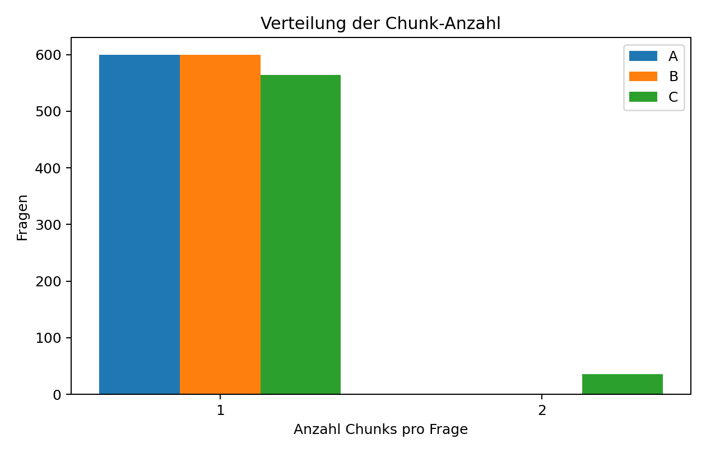
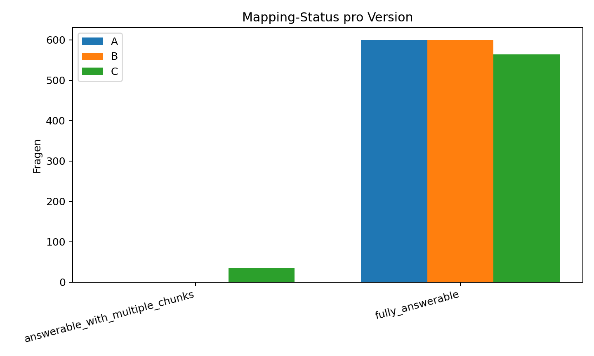
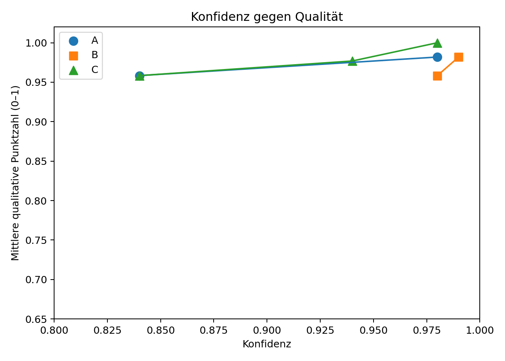
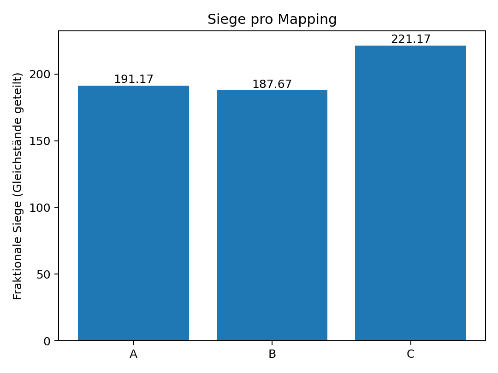
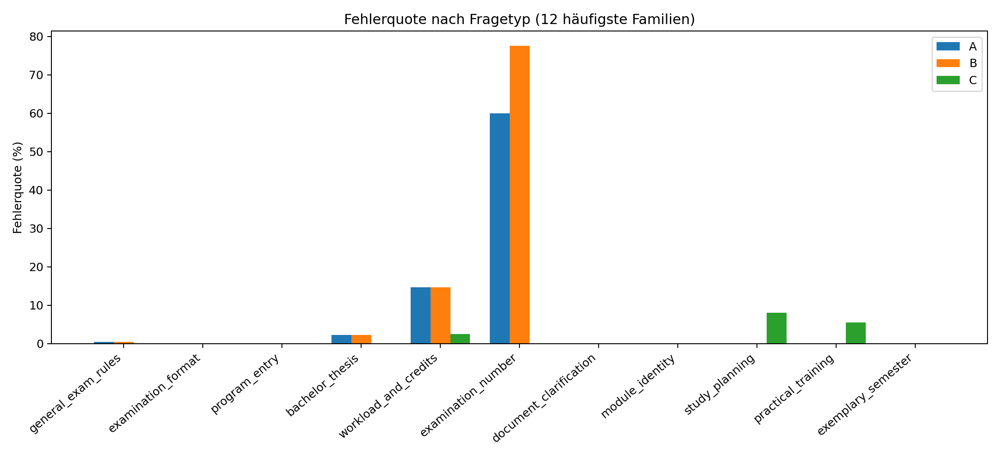
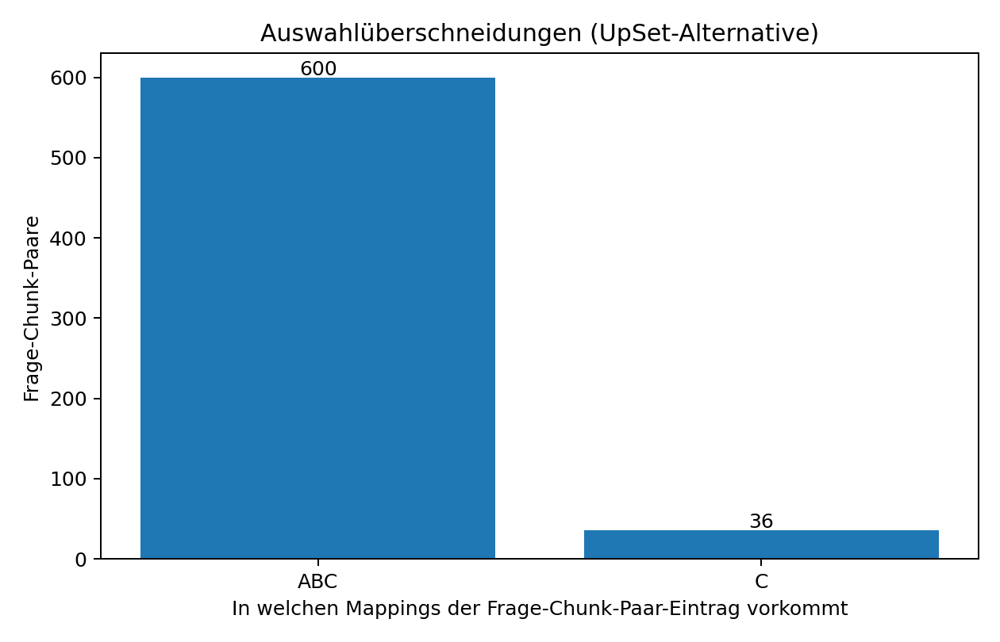
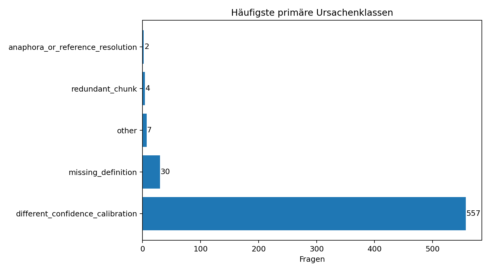

# Evaluationsbericht: Vergleich der QA-Mappings A, B und C

**Zuordnung der Versionen:** A = `qa_mappings_v1.jsonl`, B = `qa_mappings_v2.jsonl`, C = `qa_mappings_v11.jsonl`.

## 1. Executive Summary

Es wurden **600 Fragen** gegen **201 Chunks** und drei unabhängig erzeugte Mapping-Dateien geprüft. Die drei Mappings stimmen bei den normalisierten `all_required_chunk_ids` in **564 von 600 Fällen (94,00 %)** vollständig überein. A und B wählen sogar in allen 600 Fällen exakt dieselbe Chunk-Menge; C ergänzt bei 36 Fragen jeweils genau einen Supporting-Chunk. Die durchschnittliche Jaccard-Ähnlichkeit beträgt A–B **1,0000**, A–C **0,9700** und B–C **0,9700**.

Die inhaltliche Volltextprüfung ergibt **32 klare Siege für C**, **4 geteilte Siege A/B**, **7 geteilte Siege A/C** und **557 vollständige Gleichstände**. Kein Fall ist unentscheidbar, und bei keiner Frage sind alle drei Mappings vollständig unzureichend. Gegen den evaluativ erzeugten korrigierten Konsens erreicht C **596/600 exakte Treffer (99,33 %)**, A **568/600 (94,67 %)** und B **568/600 (94,67 %)**; B fällt zusätzlich in sieben Fällen durch eine unplausible Evidenzstärke auf.

**Gesamturteil:** C ist `best_overall`. A ist `strong`. B ist wegen seiner praktisch durchgehend sehr hohen Konfidenz und der sieben falsch als direkt eingestuften Negativbefunde `usable_with_review`. Für die produktive Verwendung ist das **korrigierte Konsens-Mapping** vorzuziehen: Es übernimmt C in 32 echten Kontextfällen und A in den übrigen 568 Fällen.

## 2. Eingabedaten und Validierung

| Datei | Zeilen | Gültige Objekte | Ungültige Zeilen | Eindeutige IDs | Duplikat-IDs | Fehlende Pflichtfelder | Leere IDs | Leere Texte | Typfehler |
| --- | --- | --- | --- | --- | --- | --- | --- | --- | --- |
| qSet_PO(1).jsonl | 600 | 600 | 0 | 600 | 0 | 0 | 0 | 0 | 0 |
| PO_25_CL_chunks(1).jsonl | 201 | 201 | 0 | 201 | 0 | 0 | 0 | 0 | 0 |
| qa_mappings_v1.jsonl | 600 | 600 | 0 | 600 | 0 | 0 | 0 | 0 | 0 |
| qa_mappings_v2.jsonl | 600 | 600 | 0 | 600 | 0 | 0 | 0 | 0 | 0 |
| qa_mappings_v11.jsonl | 600 | 600 | 0 | 600 | 0 | 0 | 0 | 0 | 0 |

| Prüfung | Anzahl | Bewertung |
| --- | --- | --- |
| Parsing-/JSON-Fehler | 0 | Keine ungültigen JSONL-Zeilen. |
| Schema-/Typfehler | 0 | Keine fehlenden Pflichtfelder, leeren IDs/Textfelder oder inkonsistenten Datentypen. |
| Ungültige Chunk-IDs | 0 | Alle referenzierten IDs existieren im Chunk-Datensatz. |
| Rollen-/all_required-Fehler | 0 | Rollenunion und `all_required_chunk_ids` sind in allen 1.800 Mapping-Einträgen konsistent. |
| Evidenzzitatfehler | 0 | Alle 1.836 Evidenztexte kommen exakt im zugehörigen Chunk vor. |
| Nichtkanonische Listenreihenfolge | 60 | 9 Hinweise in A, 51 in C; nur Normalisierungshinweis, keine Inhaltsänderung. |
| Partielle Seitenabdeckung | 77 | Alle in B; die angegebenen Seiten liegen innerhalb der ausgewählten Cross-Page-Chunks, decken aber nicht immer deren gesamten Seitenbereich ab. |

Alle drei Mappings enthalten dieselben 600 `question_id`-Werte in derselben Reihenfolge wie der ursprüngliche Fragensatz. Fragetexte stimmen mit dem Fragensatz überein. `source_layers` sind mit den ausgewählten Chunks konsistent. Die 137 verbleibenden Einträge in `mapping_validation_issues.csv` sind ausschließlich Informationshinweise, keine Fehler oder Warnungen.

## 3. Methodik

Alle berechenbaren Schritte wurden mit Python durchgeführt: JSONL-Parsing, Schema- und Typprüfung, deterministische Joins über `question_id`, Chunk-ID-Prüfung, Mengen- und Rollenvergleiche, Korrelationen, Kappa, Kalibrierungsmetriken, Gruppierungen, Rankings, Export und Diagramme. Es wurde kein Goldstandard vorausgesetzt. Die Mehrheitsmenge diente nur als Vergleichsvariante.

Für technische Vergleiche wurden Listen sortiert und dedupliziert; `null` und semantisch leere Listen wurden gleichbehandelt. Originalwerte bleiben in den Ausgabedateien erhalten. Jaccard ist `|A∩B|/|A∪B|`; der Overlap-Koeffizient ist `|A∩B|/min(|A|,|B|)`. Die gewichtete Rollenübereinstimmung ist ein gewichteter Jaccard über Chunk-Rollen mit `primary=3`, `supporting=2`, `disambiguating=1`. Die Sensitivitätsanalyse verwendet `primary=5`, `supporting=2`, `disambiguating=1`.

Für jede Frage wurden 12 Qualitätskriterien mit 0–2 Punkten bewertet (maximal 24). Der Rohscore ist nur Hilfsmittel; die endgültige Entscheidung für die 43 substanziellen Abweichungen basiert auf Fragetext, Metadaten, vollständigem Chunk-Text, Rollen, Evidenz, Status, Evidenzstärke, Konfidenz und Plausibilitätsfeldern. Naheliegende Chunks derselben Seiten, Module, Paragraphen und benachbarter `source_order`-Positionen wurden zusätzlich geprüft und in `mapping_differences_detailed.jsonl` dokumentiert.

## 4. Globale Übereinstimmung

| Paar | Exakte Menge | Jaccard Ø | Median | Std. | Overlap Ø | |Δ Chunks| Ø | Rollen gleich | Status gleich | Kappa Status | Kappa Evidenz | Pearson Konf. | Spearman Konf. | MAE Konf. | Rollenmetrik 3/2/1 | Rollenmetrik 5/2/1 |
| --- | --- | --- | --- | --- | --- | --- | --- | --- | --- | --- | --- | --- | --- | --- | --- |
| A-B | 600/600 (100.00 %) | 1.0000 | 1.0000 | 0.0000 | 1.0000 | 0.0000 | 100.00 % | 100.00 % | nicht berechenbar | 0.4971 | 1 | 1 | 0.0115 | 1 | 1 |
| A-C | 564/600 (94.00 %) | 0.9700 | 1.0000 | 0.1187 | 1.0000 | 0.0600 | 94.00 % | 94.00 % | 0 | 0.2715 | 0.8412 | 0.4162 | 0.0024 | 0.976 | 0.9829 |
| B-C | 564/600 (94.00 %) | 0.9700 | 1.0000 | 0.1187 | 1.0000 | 0.0600 | 94.00 % | 94.00 % | 0 | 0.1238 | 0.8412 | 0.4162 | 0.0139 | 0.976 | 0.9829 |

Der Overlap-Koeffizient beträgt trotz der 36 Abweichungen überall 1,0000, weil C in diesen Fällen stets eine Obermenge der A/B-Auswahl bildet. Das zeigt, warum reine Überschneidungsmetriken die qualitative Frage nach notwendigem oder redundantem Kontext nicht beantworten. Cohen’s Kappa für den A–B-Status ist nicht berechenbar, weil beide Mappings ausschließlich `fully_answerable` verwenden und damit keine Varianz vorliegt.

## 5. Paarweiser Vergleich

**A gegen B:** 100,00 % identische Chunk-Mengen und Rollen. Sie unterscheiden sich bei sieben Evidenzstärken, bei allen 600 Konfidenzwerten und in der Formulierung der Evidenz-/Antwortfelder. B setzt für 593 Fragen 0,99 und für sieben negative Modulprüfungsfragen 0,98; A setzt 0,98 beziehungsweise 0,84.

**A gegen C:** 564 identische Mengen. In 36 Fällen ergänzt C einen Supporting-Chunk und ändert Status zu `answerable_with_multiple_chunks`, Evidenzstärke zu `direct_with_context` und Cross-Chunk-Reasoning zu `true`. Die Hauptgewichtung ergibt 0,9760 Rollenübereinstimmung; die primärlastigere Sensitivitätsgewichtung 0,9829.

**B gegen C:** dieselben 36 Chunk-Unterschiede plus sieben Evidenzstärken. Die Konfidenz-MAE ist mit 0,0139 am höchsten.

## 6. Drei-Wege-Vergleich

| Kennzahl | Wert |
| --- | --- |
| Identische Chunk-Mengen | 564/600 (94.00 %) |
| Identischer Status | 564 |
| Identische Evidenzstärke | 557 |
| Identische Rollen | 564 |
| Strikte vollständige Drei-Wege-Übereinstimmung | 0 |
| Substantielle Übereinstimmung (Chunks/Rollen/Status/Evidenzstärke) | 557 |
| 2-gegen-1-Situationen | 43 |
| Alle drei substantiell verschieden | 0 |
| Ein Mapping leer, andere nicht | 0 |
| Unterschiedliche Chunk-Anzahl | 36 |
| Unterschiedliche Quellenlayer | 0 |
| Primärklassen | {"confidence_only_difference": 557, "same_core_extra_context": 36, "other": 7} |

Die strikte Übereinstimmung ist null, weil die Konfidenzen in allen 600 Fragen voneinander abweichen und B seine Evidenz-/Antwortformulierungen systematisch anders ausgibt. Inhaltlich substantiell sind 557 Fragen gleich; 36 sind `same_core_extra_context`, sieben fallen unter `other` wegen unterschiedlicher Evidenzstärke.

## 7. Chunk-Mengen und Sparsamkeit

| Mapping | Ø | Median | Min | Max | Std. | Ein Chunk | Mehrere Chunks | >2 | >3 | >4 | >5 | Leer | Potenziell redundant | Potenziell unvollständig | Scope-Klassen |
| --- | --- | --- | --- | --- | --- | --- | --- | --- | --- | --- | --- | --- | --- | --- | --- |
| A | 1 | 1 | 1 | 1 | 0 | 600 (100.00 %) | 0 (0.00 %) | 0 | 0 | 0 | 0 | 0 | 0 | 32 | {"complete_and_minimal": 568, "incomplete": 32} |
| B | 1 | 1 | 1 | 1 | 0 | 600 (100.00 %) | 0 (0.00 %) | 0 | 0 | 0 | 0 | 0 | 0 | 32 | {"complete_and_minimal": 568, "incomplete": 32} |
| C | 1.06 | 1 | 1 | 2 | 0.2375 | 564 (94.00 %) | 36 (6.00 %) | 0 | 0 | 0 | 0 | 0 | 4 | 0 | {"complete_and_minimal": 596, "complete_but_redundant": 4} |

A und B sind maximal sparsam, aber in 32 Fällen zu sparsam. C nimmt bei 6,00 % der Fragen einen zweiten Chunk auf; davon sind 32 Ergänzungen notwendig und vier redundant. Der korrigierte Konsens hat durchschnittlich 1,0533 Chunks pro Frage und liegt damit knapp unter C (1,0600), aber deutlich vollständiger als A/B.

## 8. Status-, Evidenz- und Konfidenzvergleich

A und B setzen für alle 600 Fragen `fully_answerable`. C verwendet dies 564-mal und `answerable_with_multiple_chunks` 36-mal. Bei der Evidenzstärke nutzt A `direct` 593-mal und `inferred` siebenmal; B nutzt `direct` 593-mal und `direct_with_context` siebenmal; C nutzt `direct` 557-mal, `direct_with_context` 36-mal und `inferred` siebenmal.

Die sieben B-Abweichungen betreffen ausschließlich Fragen der Form „Ist für Modul X eine Modulprüfung angegeben?“. Der Chunk enthält nur Modulname, SWS und LP; die Antwort „nein“ wird aus dem Fehlen einer Prüfungsangabe geschlossen und ist daher inferiert, nicht direkt belegt.

## 9. Inhaltliche Analyse der Abweichungen

| Primäre Ursache | Anzahl | Inhaltliche Bewertung |
| --- | --- | --- |
| missing_definition | 30 | C ergänzt PO25CL-PLAN-LEGEND; A/B lassen Pnr., MP oder PBB ohne ausgewählte Definitionsstelle. |
| anaphora_or_reference_resolution | 2 | C löst Verweise auf § 15 Abs. 5/6 auf; A/B belassen die Referenz im Primärchunk. |
| redundant_chunk | 4 | C ergänzt PO25CL-GEN-C01-P02-A01, obwohl die Frage LP bereits als ECTS-Leistungspunkte bezeichnet. |
| other / evidence-strength calibration | 7 | B behandelt das Nichtvorhandensein einer Modulprüfung als `direct_with_context`; A/C korrekt `inferred`. |
| different_confidence_calibration | 557 | Gleiche substantielle Zuordnung; nur Konfidenz und Ausgabeformulierungen unterscheiden sich. |

### 9.1 Echte Cross-Reference-Fälle

**Q0245:** `PO25CL-GEN-C03-P15-A08` erlaubt Gruppenarbeit nur bei eindeutig abgrenzbarem, bewertbarem Individualbeitrag **und** erfüllten Anforderungen nach Absatz 6. `PO25CL-GEN-C03-P15-A06` beschreibt diese Anforderungen. C ist vollständig; A/B lassen den Bedingungsverweis ungelöst.

**Q0327:** `PO25CL-GEN-C03-P19-A06` erlaubt die Themenrückgabe bei Wiederholung nur, wenn die Möglichkeit bei der ersten Arbeit nicht genutzt wurde, verweist aber auf § 15 Abs. 5. `PO25CL-GEN-C03-P15-A05` liefert die Vierwochenfrist und die Einmaligkeit. C ist vollständig.

### 9.2 Abkürzungen im exemplarischen Studienverlaufsplan

Bei 30 Fragen enthält der Primärchunk die konkrete Zahl, aber nur in abgekürzter Form (`Pnr.`, `MP`, `PBB`). `PO25CL-PLAN-LEGEND` löst die Abkürzungen explizit auf. Da die Frage die ausgeschriebenen Begriffe verwendet, ist die Legende eine notwendige terminologische Brücke. C ist in allen 30 Fällen minimal vollständig; A/B bleiben praktisch verständlich, aber quellenformal unvollständig.

### 9.3 Allgemeine LP-Definition

Bei Q0036, Q0064, Q0067 und Q0113 nennt der Primärchunk die gesuchte Zahl direkt in LP. Die Frage selbst bezeichnet LP bereits als ECTS-Leistungspunkte. `PO25CL-GEN-C01-P02-A01` erklärt nur die allgemeine Definition und den Arbeitsaufwand pro LP; für die konkrete Zahl ist dieser Chunk nicht notwendig. A und B sind hier sparsamer und gleich gut; C ist vollständig, aber redundant.

### 9.4 Negative Modulprüfungsangaben

Bei sieben Fragen wird aus einer Modulübersicht ohne Prüfungsfeld geschlossen, dass keine Modulprüfung angegeben ist. A und C kennzeichnen die Evidenz korrekt als `inferred`. B setzt `direct_with_context` und 0,98 Konfidenz. Die Chunk-Menge ist gleich, aber Evidenztyp und Kalibrierung sind bei B schwächer.

## 10. Warum die Unterschiede wahrscheinlich entstanden

Die folgenden Ursachen sind **Inferenz aus den beobachteten Ausgaben**, keine Einsicht in interne Modellzustände:

1. C scheint eine konservative Kontextregel zu verwenden: Abkürzungen und explizite Paragraphenverweise werden durch Definitions- beziehungsweise Referenzchunks ergänzt. Das verbessert 32 Fälle, führt aber bei vier LP-Fragen zu Überauswahl.
2. A und B optimieren offenbar stark auf Ein-Chunk-Minimalität. Das funktioniert in 568 Fällen, versagt aber bei 30 Abkürzungsauflösungen und zwei rechtlichen Cross-References.
3. B behandelt das Fehlen einer Tabellenangabe als direkte Evidenz. Dies deutet auf eine unzureichende Trennung zwischen positivem Textbeleg und Schluss aus Abwesenheit hin.
4. B kalibriert fast ohne Varianz (0,98–0,99). A und C senken bei inferierten Negativbefunden auf 0,84; C senkt bei Multi-Chunk-Fällen auf 0,94.
5. Die 77 Seitenhinweise in B zeigen eine andere Metadatenkonvention: B nennt häufig nur die Seite mit dem konkreten Satz innerhalb eines Cross-Page-Chunks, A/C den gesamten Chunk-Seitenbereich. Beide Varianten sind mit den Chunks vereinbar.

## 11. Bestes Mapping je substantieller Differenz

Die folgende Tabelle umfasst alle 43 substanziellen Differenzen. Die 557 übrigen Fragen sind inhaltlich gleich und als `all_tied` bewertet; alle 600 Einzelbewertungen einschließlich Kriterienpunkten, Volltexten und Alternativchunks stehen in den Detaildateien.

| ID | Frage | A | B | C | Score A/B/C | Bestes Mapping | Primäre Ursache | Empfohlene Chunk-Menge |
| --- | --- | --- | --- | --- | --- | --- | --- | --- |
| Q0036 | Wie viele ECTS-Leistungspunkte umfasst ein Modul mindestens? | PO25CL-GEN-C01-P03-A03 | PO25CL-GEN-C01-P03-A03 | PO25CL-GEN-C01-P03-A03 PO25CL-GEN-C01-P02-A01 | 24/24/19 | A_and_B_tied | redundant_chunk | PO25CL-GEN-C01-P03-A03 |
| Q0064 | Wie viele ECTS-Leistungspunkte umfasst der Profilbildungsbereich in der Regel? | PO25CL-GEN-C01-P05-A02 | PO25CL-GEN-C01-P05-A02 | PO25CL-GEN-C01-P05-A02 PO25CL-GEN-C01-P02-A01 | 24/24/19 | A_and_B_tied | redundant_chunk | PO25CL-GEN-C01-P05-A02 |
| Q0067 | Wie viele ECTS-Leistungspunkte dürfen fachwissenschaftliche Propädeutika pro Studienfach höchstens umfassen? | PO25CL-GEN-C01-P05-A02 | PO25CL-GEN-C01-P05-A02 | PO25CL-GEN-C01-P05-A02 PO25CL-GEN-C01-P02-A01 | 24/24/19 | A_and_B_tied | redundant_chunk | PO25CL-GEN-C01-P05-A02 |
| Q0113 | Wie viele ECTS-Leistungspunkte werden für vier Wochen Berufsfeldpraktikum mindestens angerechnet? | PO25CL-GEN-C02-P09-A01 | PO25CL-GEN-C02-P09-A01 | PO25CL-GEN-C02-P09-A01 PO25CL-GEN-C01-P02-A01 | 24/24/19 | A_and_B_tied | redundant_chunk | PO25CL-GEN-C02-P09-A01 |
| Q0245 | Kann die Bachelorarbeit als Gruppenarbeit zugelassen werden? | PO25CL-GEN-C03-P15-A08 | PO25CL-GEN-C03-P15-A08 | PO25CL-GEN-C03-P15-A08 PO25CL-GEN-C03-P15-A06 | 15/15/24 | C_best | anaphora_or_reference_resolution | PO25CL-GEN-C03-P15-A06 PO25CL-GEN-C03-P15-A08 |
| Q0327 | Wann darf bei der Wiederholung einer Bachelorarbeit das Thema zurückgegeben werden? | PO25CL-GEN-C03-P19-A06 | PO25CL-GEN-C03-P19-A06 | PO25CL-GEN-C03-P19-A06 PO25CL-GEN-C03-P15-A05 | 15/15/24 | C_best | anaphora_or_reference_resolution | PO25CL-GEN-C03-P15-A05 PO25CL-GEN-C03-P19-A06 |
| Q0500 | Ist für das Basismodul – Statistische Methoden in der Computerlinguistik eine Modulprüfung angegeben? | PO25CL-APP-R07-M06 | PO25CL-APP-R07-M06 | PO25CL-APP-R07-M06 | 23/23/23 | A_and_C_tied | other | PO25CL-APP-R07-M06 |
| Q0506 | Ist für das Aufbaumodul – Mathematische Linguistik eine Modulprüfung angegeben? | PO25CL-APP-R07-M08 | PO25CL-APP-R07-M08 | PO25CL-APP-R07-M08 | 23/23/23 | A_and_C_tied | other | PO25CL-APP-R07-M08 |
| Q0509 | Ist für das Aufbaumodul – Parsing eine Modulprüfung angegeben? | PO25CL-APP-R07-M09 | PO25CL-APP-R07-M09 | PO25CL-APP-R07-M09 | 23/23/23 | A_and_C_tied | other | PO25CL-APP-R07-M09 |
| Q0512 | Ist für das Aufbaumodul – Logische Programmierung eine Modulprüfung angegeben? | PO25CL-APP-R07-M10 | PO25CL-APP-R07-M10 | PO25CL-APP-R07-M10 | 23/23/23 | A_and_C_tied | other | PO25CL-APP-R07-M10 |
| Q0518 | Ist für das Modul Praktikum und Orientierung eine Modulprüfung angegeben? | PO25CL-APP-R07-M12 | PO25CL-APP-R07-M12 | PO25CL-APP-R07-M12 | 23/23/23 | A_and_C_tied | other | PO25CL-APP-R07-M12 |
| Q0524 | Ist für das Vertiefungsmodul – Computerlinguistik 1 eine Modulprüfung angegeben? | PO25CL-APP-R07-M14 | PO25CL-APP-R07-M14 | PO25CL-APP-R07-M14 | 23/23/23 | A_and_C_tied | other | PO25CL-APP-R07-M14 |
| Q0530 | Ist für das Modul Abschlussarbeit und Forschungskolloquium eine Modulprüfung angegeben? | PO25CL-APP-R07-M16 | PO25CL-APP-R07-M16 | PO25CL-APP-R07-M16 | 23/23/23 | A_and_C_tied | other | PO25CL-APP-R07-M16 |
| Q0542 | Wie viele Modulprüfungen nennt die Summenzeile für das 1. Semester? | PO25CL-PLAN-S01-SUM | PO25CL-PLAN-S01-SUM | PO25CL-PLAN-S01-SUM PO25CL-PLAN-LEGEND | 16/16/24 | C_best | missing_definition | PO25CL-PLAN-LEGEND PO25CL-PLAN-S01-SUM |
| Q0546 | Wie viele LP entfallen laut Summenzeile des 1. Semesters auf den Profilbildungsbereich? | PO25CL-PLAN-S01-SUM | PO25CL-PLAN-S01-SUM | PO25CL-PLAN-S01-SUM PO25CL-PLAN-LEGEND | 16/16/24 | C_best | missing_definition | PO25CL-PLAN-LEGEND PO25CL-PLAN-S01-SUM |
| Q0548 | Wie viele Modulprüfungen nennt die Summenzeile für das 2. Semester? | PO25CL-PLAN-S02-SUM | PO25CL-PLAN-S02-SUM | PO25CL-PLAN-S02-SUM PO25CL-PLAN-LEGEND | 16/16/24 | C_best | missing_definition | PO25CL-PLAN-LEGEND PO25CL-PLAN-S02-SUM |
| Q0552 | Wie viele LP entfallen laut Summenzeile des 2. Semesters auf den Profilbildungsbereich? | PO25CL-PLAN-S02-SUM | PO25CL-PLAN-S02-SUM | PO25CL-PLAN-S02-SUM PO25CL-PLAN-LEGEND | 16/16/24 | C_best | missing_definition | PO25CL-PLAN-LEGEND PO25CL-PLAN-S02-SUM |
| Q0554 | Wie viele Modulprüfungen nennt die Summenzeile für das 3. Semester? | PO25CL-PLAN-S03-SUM | PO25CL-PLAN-S03-SUM | PO25CL-PLAN-S03-SUM PO25CL-PLAN-LEGEND | 16/16/24 | C_best | missing_definition | PO25CL-PLAN-LEGEND PO25CL-PLAN-S03-SUM |
| Q0558 | Wie viele LP entfallen laut Summenzeile des 3. Semesters auf den Profilbildungsbereich? | PO25CL-PLAN-S03-SUM | PO25CL-PLAN-S03-SUM | PO25CL-PLAN-S03-SUM PO25CL-PLAN-LEGEND | 16/16/24 | C_best | missing_definition | PO25CL-PLAN-LEGEND PO25CL-PLAN-S03-SUM |
| Q0560 | Wie viele Modulprüfungen nennt die Summenzeile für das 4. Semester? | PO25CL-PLAN-S04-SUM | PO25CL-PLAN-S04-SUM | PO25CL-PLAN-S04-SUM PO25CL-PLAN-LEGEND | 16/16/24 | C_best | missing_definition | PO25CL-PLAN-LEGEND PO25CL-PLAN-S04-SUM |
| Q0564 | Wie viele LP entfallen laut Summenzeile des 4. Semesters auf den Profilbildungsbereich? | PO25CL-PLAN-S04-SUM | PO25CL-PLAN-S04-SUM | PO25CL-PLAN-S04-SUM PO25CL-PLAN-LEGEND | 16/16/24 | C_best | missing_definition | PO25CL-PLAN-LEGEND PO25CL-PLAN-S04-SUM |
| Q0566 | Wie viele Modulprüfungen nennt die Summenzeile für das 5. Semester? | PO25CL-PLAN-S05-SUM | PO25CL-PLAN-S05-SUM | PO25CL-PLAN-S05-SUM PO25CL-PLAN-LEGEND | 16/16/24 | C_best | missing_definition | PO25CL-PLAN-LEGEND PO25CL-PLAN-S05-SUM |
| Q0570 | Wie viele LP entfallen laut Summenzeile des 5. Semesters auf den Profilbildungsbereich? | PO25CL-PLAN-S05-SUM | PO25CL-PLAN-S05-SUM | PO25CL-PLAN-S05-SUM PO25CL-PLAN-LEGEND | 16/16/24 | C_best | missing_definition | PO25CL-PLAN-LEGEND PO25CL-PLAN-S05-SUM |
| Q0572 | Wie viele Modulprüfungen nennt die Summenzeile für das 6. Semester? | PO25CL-PLAN-S06-SUM | PO25CL-PLAN-S06-SUM | PO25CL-PLAN-S06-SUM PO25CL-PLAN-LEGEND | 16/16/24 | C_best | missing_definition | PO25CL-PLAN-LEGEND PO25CL-PLAN-S06-SUM |
| Q0576 | Wie viele LP entfallen laut Summenzeile des 6. Semesters auf den Profilbildungsbereich? | PO25CL-PLAN-S06-SUM | PO25CL-PLAN-S06-SUM | PO25CL-PLAN-S06-SUM PO25CL-PLAN-LEGEND | 16/16/24 | C_best | missing_definition | PO25CL-PLAN-LEGEND PO25CL-PLAN-S06-SUM |
| Q0577 | Welche Prüfungsnummer hat Einführung in die computationelle Logik? | PO25CL-PLAN-S01-M01 | PO25CL-PLAN-S01-M01 | PO25CL-PLAN-S01-M01 PO25CL-PLAN-LEGEND | 16/16/24 | C_best | missing_definition | PO25CL-PLAN-LEGEND PO25CL-PLAN-S01-M01 |
| Q0578 | Welche Prüfungsnummer hat Mathematische Grundlagen? | PO25CL-PLAN-S01-M01 | PO25CL-PLAN-S01-M01 | PO25CL-PLAN-S01-M01 PO25CL-PLAN-LEGEND | 16/16/24 | C_best | missing_definition | PO25CL-PLAN-LEGEND PO25CL-PLAN-S01-M01 |
| Q0580 | Welche Prüfungsnummer hat das Seminar Einführung in die Computerlinguistik? | PO25CL-PLAN-S01-M02 | PO25CL-PLAN-S01-M02 | PO25CL-PLAN-S01-M02 PO25CL-PLAN-LEGEND | 16/16/24 | C_best | missing_definition | PO25CL-PLAN-LEGEND PO25CL-PLAN-S01-M02 |
| Q0581 | Welche Prüfungsnummer hat das Seminar Einführung in die Programmierung mit Python? | PO25CL-PLAN-S01-M03 | PO25CL-PLAN-S01-M03 | PO25CL-PLAN-S01-M03 PO25CL-PLAN-LEGEND | 16/16/24 | C_best | missing_definition | PO25CL-PLAN-LEGEND PO25CL-PLAN-S01-M03 |
| Q0583 | Welche Prüfungsnummer hat das Seminar Grammatikformalismen? | PO25CL-PLAN-S02-M01 | PO25CL-PLAN-S02-M01 | PO25CL-PLAN-S02-M01 PO25CL-PLAN-LEGEND | 16/16/24 | C_best | missing_definition | PO25CL-PLAN-LEGEND PO25CL-PLAN-S02-M01 |
| Q0586 | Welche Prüfungsnummer hat Wahrscheinlichkeitstheorie und Statistik? | PO25CL-PLAN-S02-M04 | PO25CL-PLAN-S02-M04 | PO25CL-PLAN-S02-M04 PO25CL-PLAN-LEGEND | 16/16/24 | C_best | missing_definition | PO25CL-PLAN-LEGEND PO25CL-PLAN-S02-M04 |
| Q0587 | Welche Prüfungsnummer hat Linguistische Ressourcen? | PO25CL-PLAN-S03-M01 | PO25CL-PLAN-S03-M01 | PO25CL-PLAN-S03-M01 PO25CL-PLAN-LEGEND | 16/16/24 | C_best | missing_definition | PO25CL-PLAN-LEGEND PO25CL-PLAN-S03-M01 |
| Q0588 | Welche Prüfungsnummer hat Grundlagen des maschinellen Lernens? | PO25CL-PLAN-S03-M02 | PO25CL-PLAN-S03-M02 | PO25CL-PLAN-S03-M02 PO25CL-PLAN-LEGEND | 16/16/24 | C_best | missing_definition | PO25CL-PLAN-LEGEND PO25CL-PLAN-S03-M02 |
| Q0589 | Welche Prüfungsnummer hat das Seminar Automatentheorie & Formale Sprachen? | PO25CL-PLAN-S03-M03 | PO25CL-PLAN-S03-M03 | PO25CL-PLAN-S03-M03 PO25CL-PLAN-LEGEND | 16/16/24 | C_best | missing_definition | PO25CL-PLAN-LEGEND PO25CL-PLAN-S03-M03 |
| Q0591 | Welche Prüfungsnummer hat das Seminar Deep Learning? | PO25CL-PLAN-S04-M01 | PO25CL-PLAN-S04-M01 | PO25CL-PLAN-S04-M01 PO25CL-PLAN-LEGEND | 16/16/24 | C_best | missing_definition | PO25CL-PLAN-LEGEND PO25CL-PLAN-S04-M01 |
| Q0592 | Welche Prüfungsnummer hat das Parsing-Seminar? | PO25CL-PLAN-S04-M02 | PO25CL-PLAN-S04-M02 | PO25CL-PLAN-S04-M02 PO25CL-PLAN-LEGEND | 16/16/24 | C_best | missing_definition | PO25CL-PLAN-LEGEND PO25CL-PLAN-S04-M02 |
| Q0593 | Welche Prüfungsnummer hat das Seminar Einführung in Prolog? | PO25CL-PLAN-S04-M03 | PO25CL-PLAN-S04-M03 | PO25CL-PLAN-S04-M03 PO25CL-PLAN-LEGEND | 16/16/24 | C_best | missing_definition | PO25CL-PLAN-LEGEND PO25CL-PLAN-S04-M03 |
| Q0594 | Welche Prüfungsnummer hat das Seminar nach Wahl im ersten Teil des interdisziplinären Vertiefungsmoduls? | PO25CL-PLAN-S04-M04 | PO25CL-PLAN-S04-M04 | PO25CL-PLAN-S04-M04 PO25CL-PLAN-LEGEND | 16/16/24 | C_best | missing_definition | PO25CL-PLAN-LEGEND PO25CL-PLAN-S04-M04 |
| Q0595 | Welche Prüfungsnummer hat das Orientierungsseminar? | PO25CL-PLAN-S04-M05 | PO25CL-PLAN-S04-M05 | PO25CL-PLAN-S04-M05 PO25CL-PLAN-LEGEND | 16/16/24 | C_best | missing_definition | PO25CL-PLAN-LEGEND PO25CL-PLAN-S04-M05 |
| Q0596 | Welche Prüfungsnummer hat das Praktikum im fünften Semester? | PO25CL-PLAN-S05-M01 | PO25CL-PLAN-S05-M01 | PO25CL-PLAN-S05-M01 PO25CL-PLAN-LEGEND | 16/16/24 | C_best | missing_definition | PO25CL-PLAN-LEGEND PO25CL-PLAN-S05-M01 |
| Q0597 | Welche Prüfungsnummer hat die Modulprüfung im interdisziplinären Vertiefungsmodul? | PO25CL-PLAN-S05-M02 | PO25CL-PLAN-S05-M02 | PO25CL-PLAN-S05-M02 PO25CL-PLAN-LEGEND | 16/16/24 | C_best | missing_definition | PO25CL-PLAN-LEGEND PO25CL-PLAN-S05-M02 |
| Q0598 | Welche Prüfungsnummer hat das erste Wahlseminar im Vertiefungsmodul Computerlinguistik 1? | PO25CL-PLAN-S05-M03 | PO25CL-PLAN-S05-M03 | PO25CL-PLAN-S05-M03 PO25CL-PLAN-LEGEND | 16/16/24 | C_best | missing_definition | PO25CL-PLAN-LEGEND PO25CL-PLAN-S05-M03 |
| Q0599 | Welche Prüfungsnummer hat die Bachelorarbeit? | PO25CL-PLAN-S06-M02 | PO25CL-PLAN-S06-M02 | PO25CL-PLAN-S06-M02 PO25CL-PLAN-LEGEND | 16/16/24 | C_best | missing_definition | PO25CL-PLAN-LEGEND PO25CL-PLAN-S06-M02 |
## 12. Gesamtbewertung von A, B und C

| Mapping | Einstufung | Vollständig korrekt | Teilweise korrekt | Unvollständig | Redundant | Falsche/zusätzliche Chunks | Falsche Layer | Statusfehler | Evidenzfehler | Hochkonfidente Fehler | Score Ø | Score Median | Chunks Ø | Precision | Recall | F1 | Exakt Konsens |
| --- | --- | --- | --- | --- | --- | --- | --- | --- | --- | --- | --- | --- | --- | --- | --- | --- | --- |
| A | strong | 568 | 32 | 32 | 0 | 0 | 0 | 32 | 32 | 32 | 23.5583 | 24 | 1 | 1 | 0.9494 | 0.974 | 568/600 (94.67 %) |
| B | usable_with_review | 561 | 39 | 32 | 0 | 0 | 0 | 32 | 39 | 39 | 23.5583 | 24 | 1 | 1 | 0.9494 | 0.974 | 568/600 (94.67 %) |
| C | best_overall | 596 | 4 | 0 | 4 | 4 | 0 | 4 | 4 | 4 | 23.955 | 24 | 1.06 | 0.9937 | 1 | 0.9968 | 596/600 (99.33 %) |

**Siege:** einzigartige Siege A=0, B=0, C=32; geteilte A/B=4, A/C=7, alle drei=557. Bei Gleichstandsaufteilung ergeben sich A=191.17, B=187.67, C=221.17 fraktionale Siege. Tie-inklusive gewinnen A in 568, B in 561 und C in 596 Fragen.

## 13. Konsens-, Union-, Intersection- und Oracle-Analyse

| Variante | Exakt korrekt | Rate | Vollständig | Vollständigkeitsrate | Redundant | Fehlende notwendige Chunks | Chunks Ø |
| --- | --- | --- | --- | --- | --- | --- | --- |
| Mehrheitskonsens ≥2 | 568 | 94.67 % | 568 | 94.67 % | 0 | 32 | 1 |
| Vereinigung | 596 | 99.33 % | 600 | 100.00 % | 4 | 0 | 1.06 |
| Schnittmenge | 568 | 94.67 % | 568 | 94.67 % | 0 | 32 | 1 |
| Korrigierter Konsens | 600 | 100.00 % | 600 | 100.00 % | 0 | 0 | 1.0533 |
| Best-of-three Oracle | 600 | 100.00 % | 600 | 100.00 % | 0 | 0 | aus vorhandenen Mappings gewählt |

Mehrheitskonsens und Schnittmenge sind identisch, weil A und B immer gleich wählen. Sie verfehlen 32 notwendige Kontextchunks. Die Vereinigungsmenge entspricht den C-Chunk-Mengen und ist immer vollständig, enthält aber vier unnötige LP-Definitionschunks. Das Oracle erreicht 100 %, weil für jede Frage mindestens eines der vorhandenen Mappings der korrigierten Empfehlung entspricht. Der korrigierte Konsens entfernt die vier Redundanzen und ergänzt die 32 notwendigen Kontextchunks.

## 14. Konfidenzkalibrierung

| Mapping | Brier Score | ECE | Spearman Konf.-Qualität | Pearson Konf.-Qualität | Fehler ≥0,90 | Fehlerquote ≥0,90 | Überkonfidente Fehler | Unterkonfidente korrekte |
| --- | --- | --- | --- | --- | --- | --- | --- | --- |
| A | 0.0519 | 0.0354 | 0.3884 | 0.0335 | 32 | 5.40 % | 32 | 7 |
| B | 0.0636 | 0.0549 | 0.3884 | 0.0335 | 39 | 6.50 % | 39 | 0 |
| C | 0.0068 | 0.0235 | 0.5095 | 0.3777 | 4 | 0.67 % | 4 | 7 |

ECE-Bins: `[0,00;0,80)`, `[0,80;0,90)`, `[0,90;0,95)`, `[0,95;1,00]`. C weist den besten Brier Score (0,0068) und die niedrigste ECE (0,0235) auf. B ist am schlechtesten kalibriert: alle 600 Fälle liegen bei mindestens 0,98, darunter 39 binär fehlerhafte Bewertungen. A und C sind bei den sieben inferierten Negativfällen eher unterkonfident (0,84 trotz korrekter Zuordnung). Nicht berechenbare Kennzahlen sind ausdrücklich als solche markiert; B hat beispielsweise keine niedrige Konfidenzgruppe.

## 15. Ergebnisse nach Fragetyp

| Fragetyp | n | Chunk-Übereinstimmung | Jaccard Ø | Bestes Mapping | Fehler A/B/C | Häufigste Ursache | Chunks A/B/C |
| --- | --- | --- | --- | --- | --- | --- | --- |
| general_exam_rules | 244 | 99.59 % | 0.9986 | C | A 0.41 % / B 0.41 % / C 0.00 % | anaphora_or_reference_resolution | A 1.00 / B 1.00 / C 1.00 |
| examination_format | 60 | 100.00 % | 1 | A_and_B_and_C | A 0.00 % / B 0.00 % / C 0.00 % | — | A 1.00 / B 1.00 / C 1.00 |
| program_entry | 50 | 100.00 % | 1 | A_and_B_and_C | A 0.00 % / B 0.00 % / C 0.00 % | — | A 1.00 / B 1.00 / C 1.00 |
| bachelor_thesis | 44 | 97.73 % | 0.9924 | C | A 2.27 % / B 2.27 % / C 0.00 % | anaphora_or_reference_resolution | A 1.00 / B 1.00 / C 1.02 |
| workload_and_credits | 41 | 82.93 % | 0.9431 | C | A 14.63 % / B 14.63 % / C 2.44 % | missing_definition | A 1.00 / B 1.00 / C 1.17 |
| examination_number | 40 | 40.00 % | 0.8 | C | A 60.00 % / B 77.50 % / C 0.00 % | missing_definition | A 1.00 / B 1.00 / C 1.60 |
| document_clarification | 34 | 100.00 % | 1 | A_and_B_and_C | A 0.00 % / B 0.00 % / C 0.00 % | — | A 1.00 / B 1.00 / C 1.00 |
| module_identity | 32 | 100.00 % | 1 | A_and_B_and_C | A 0.00 % / B 0.00 % / C 0.00 % | — | A 1.00 / B 1.00 / C 1.00 |
| study_planning | 25 | 92.00 % | 0.9733 | A_and_B | A 0.00 % / B 0.00 % / C 8.00 % | redundant_chunk | A 1.00 / B 1.00 / C 1.08 |
| practical_training | 18 | 94.44 % | 0.9815 | A_and_B | A 0.00 % / B 0.00 % / C 5.56 % | redundant_chunk | A 1.00 / B 1.00 / C 1.06 |
| exemplary_semester | 12 | 100.00 % | 1 | A_and_B_and_C | A 0.00 % / B 0.00 % / C 0.00 % | — | A 1.00 / B 1.00 / C 1.00 |

Besonders schwach sind A/B bei `examination_number`: 24 der 40 Fragen benötigen die Planlegende; zusätzlich hat B sieben Evidenzstärkefehler. C ist in dieser Familie fehlerfrei. C ist dagegen bei `study_planning` und `practical_training` leicht schwächer, weil dort die vier redundanten LP-Definitionen liegen. Bei `program_entry`, `examination_format`, `document_clarification`, `module_identity` und `exemplary_semester` sind alle Mappings vollständig gleichwertig.

## 16. Ergebnisse nach Dokumentebene und Chunk-Typ

| Source Layer | n | Chunk-Übereinstimmung | Jaccard Ø | Bestes Mapping | Fehler A/B/C | Häufigste Ursache |
| --- | --- | --- | --- | --- | --- | --- |
| general_regulation | 464 | 98.71 % | 0.9957 | A_and_B | A 0.43 % / B 0.43 % / C 0.86 % | redundant_chunk |
| exemplary_plan | 68 | 55.88 % | 0.8529 | C | A 44.12 % / B 44.12 % / C 0.00 % | missing_definition |
| program_appendix | 68 | 100.00 % | 1 | A_and_C | A 0.00 % / B 10.29 % / C 0.00 % | other |

Auf der Ebene `exemplary_plan` ist C klar überlegen: A/B fehlen 30 Legendenzuordnungen. Im `program_appendix` wählen alle dieselben Chunks; B hat dort sieben Evidenzstärkefehler. Im `general_regulation` gewinnt C bei zwei Cross-References, überselektiert aber viermal die allgemeine LP-Definition.

Chunk-Eigenschaften bestätigen das Muster: Gegen den korrigierten Konsens unterselektieren A/B den Typ `abbreviation_legend` jeweils um 30 Auswahlvorgänge und `regulation_subsection` um zwei. C trifft die Legendenhäufigkeit exakt, überselektiert `regulation_subsection` um vier. Es gibt keine falschen Dokumentlayer. Unterschiede hängen nicht mit disjunkten oder ungültigen Chunks zusammen, sondern mit Kontext- und Minimalitätsentscheidungen.

## 17. Systematische Fehlermuster

- **A und B wählen systematisch genau einen Chunk:** 600/600 Fragen. Das maximiert Sparsamkeit, erzeugt aber 32 unvollständige Kontextfälle.
- **C ergänzt systematisch Kontext:** 36/600 Fragen; 30-mal Legende, viermal LP-Definition, zweimal Paragraphenverweis.
- **B bevorzugt extrem hohe Konfidenz:** Mittelwert 0,9899; Minimum 0,98. A: Mittel 0,9784; C: 0,9760.
- **B klassifiziert Negativbefunde als direkt:** sieben Modulübersichten ohne Prüfungsfeld, alle im `program_specific_appendix`.
- **C nutzt häufiger `answerable_with_multiple_chunks`:** exakt die 36 Fälle mit zusätzlichem Supporting-Chunk.
- **Keine Modul-/Semesterverwechslungen:** Für die analysierten Abweichungen stimmen Modul, Semester und Dokumentebene der Primärchunks mit den Frage-Metadaten überein.

## 18. Wichtigste Review-Fälle

| ID | Priorität | Frage | Klasse | Bestes Mapping | Ursache | Jaccard AB/AC/BC | Konfidenz A/B/C |
| --- | --- | --- | --- | --- | --- | --- | --- |
| Q0245 | high | Kann die Bachelorarbeit als Gruppenarbeit zugelassen werden? | same_core_extra_context | C_best | anaphora_or_reference_resolution | 1.00/0.50/0.50 | 0.98/0.99/0.94 |
| Q0327 | high | Wann darf bei der Wiederholung einer Bachelorarbeit das Thema zurückgegeben werden? | same_core_extra_context | C_best | anaphora_or_reference_resolution | 1.00/0.50/0.50 | 0.98/0.99/0.94 |
| Q0542 | medium_high | Wie viele Modulprüfungen nennt die Summenzeile für das 1. Semester? | same_core_extra_context | C_best | missing_definition | 1.00/0.50/0.50 | 0.98/0.99/0.94 |
| Q0546 | medium_high | Wie viele LP entfallen laut Summenzeile des 1. Semesters auf den Profilbildungsbereich? | same_core_extra_context | C_best | missing_definition | 1.00/0.50/0.50 | 0.98/0.99/0.94 |
| Q0548 | medium_high | Wie viele Modulprüfungen nennt die Summenzeile für das 2. Semester? | same_core_extra_context | C_best | missing_definition | 1.00/0.50/0.50 | 0.98/0.99/0.94 |
| Q0552 | medium_high | Wie viele LP entfallen laut Summenzeile des 2. Semesters auf den Profilbildungsbereich? | same_core_extra_context | C_best | missing_definition | 1.00/0.50/0.50 | 0.98/0.99/0.94 |
| Q0554 | medium_high | Wie viele Modulprüfungen nennt die Summenzeile für das 3. Semester? | same_core_extra_context | C_best | missing_definition | 1.00/0.50/0.50 | 0.98/0.99/0.94 |
| Q0558 | medium_high | Wie viele LP entfallen laut Summenzeile des 3. Semesters auf den Profilbildungsbereich? | same_core_extra_context | C_best | missing_definition | 1.00/0.50/0.50 | 0.98/0.99/0.94 |
| Q0560 | medium_high | Wie viele Modulprüfungen nennt die Summenzeile für das 4. Semester? | same_core_extra_context | C_best | missing_definition | 1.00/0.50/0.50 | 0.98/0.99/0.94 |
| Q0564 | medium_high | Wie viele LP entfallen laut Summenzeile des 4. Semesters auf den Profilbildungsbereich? | same_core_extra_context | C_best | missing_definition | 1.00/0.50/0.50 | 0.98/0.99/0.94 |
| Q0566 | medium_high | Wie viele Modulprüfungen nennt die Summenzeile für das 5. Semester? | same_core_extra_context | C_best | missing_definition | 1.00/0.50/0.50 | 0.98/0.99/0.94 |
| Q0570 | medium_high | Wie viele LP entfallen laut Summenzeile des 5. Semesters auf den Profilbildungsbereich? | same_core_extra_context | C_best | missing_definition | 1.00/0.50/0.50 | 0.98/0.99/0.94 |
| Q0572 | medium_high | Wie viele Modulprüfungen nennt die Summenzeile für das 6. Semester? | same_core_extra_context | C_best | missing_definition | 1.00/0.50/0.50 | 0.98/0.99/0.94 |
| Q0576 | medium_high | Wie viele LP entfallen laut Summenzeile des 6. Semesters auf den Profilbildungsbereich? | same_core_extra_context | C_best | missing_definition | 1.00/0.50/0.50 | 0.98/0.99/0.94 |
| Q0577 | medium_high | Welche Prüfungsnummer hat Einführung in die computationelle Logik? | same_core_extra_context | C_best | missing_definition | 1.00/0.50/0.50 | 0.98/0.99/0.94 |
| Q0578 | medium_high | Welche Prüfungsnummer hat Mathematische Grundlagen? | same_core_extra_context | C_best | missing_definition | 1.00/0.50/0.50 | 0.98/0.99/0.94 |
| Q0580 | medium_high | Welche Prüfungsnummer hat das Seminar Einführung in die Computerlinguistik? | same_core_extra_context | C_best | missing_definition | 1.00/0.50/0.50 | 0.98/0.99/0.94 |
| Q0581 | medium_high | Welche Prüfungsnummer hat das Seminar Einführung in die Programmierung mit Python? | same_core_extra_context | C_best | missing_definition | 1.00/0.50/0.50 | 0.98/0.99/0.94 |
| Q0583 | medium_high | Welche Prüfungsnummer hat das Seminar Grammatikformalismen? | same_core_extra_context | C_best | missing_definition | 1.00/0.50/0.50 | 0.98/0.99/0.94 |
| Q0586 | medium_high | Welche Prüfungsnummer hat Wahrscheinlichkeitstheorie und Statistik? | same_core_extra_context | C_best | missing_definition | 1.00/0.50/0.50 | 0.98/0.99/0.94 |

Die höchste Priorität haben Q0245 und Q0327, weil fehlender Kontext rechtliche Bedingungen verändert. Danach folgen die 30 Planabkürzungsfälle: Sie sind strukturell gleich, aber für reproduzierbare Quellenbelege relevant. Die vier LP-Redundanzen und sieben Evidenzstärkefälle sind primär Qualitäts- und Kalibrierungsfragen, nicht falsche zentrale Antworten.

## 19. Empfohlenes Konsens-Mapping

Das empfohlene Mapping übernimmt C für 32 Fragen: alle 30 Planfragen mit `Pnr.`, `MP` oder `PBB` sowie Q0245 und Q0327. Für die vier LP-Fragen Q0036, Q0064, Q0067 und Q0113 wird A verwendet, um den redundanten allgemeinen Definitionschunk zu entfernen. Für die sieben Negativbefunde wird A verwendet, damit `evidence_strength=inferred` erhalten bleibt. Bei den 557 vollständigen Gleichständen dient A als deterministischer Tie-Breaker. IDs und Fragetexte bleiben unverändert.

## 20. Schlussurteil

**C = `best_overall`:** beste Vollständigkeit, beste Cross-Reference- und Abkürzungsauflösung, 596/600 exakte Treffer, 32 eindeutige Siege. Schwäche: vier unnötige LP-Definitionschunks.

**A = `strong`:** sehr sparsam, korrekte Evidenzstärke bei Negativbefunden, keine redundanten Chunks. Schwäche: 32 fehlende Supporting-Chunks; 94,67 % exakte Übereinstimmung mit dem korrigierten Konsens.

**B = `usable_with_review`:** dieselbe starke Chunk-Auswahl wie A, aber schwächere Evidenztypisierung und Konfidenzkalibrierung. Sieben Negativbefunde sind fälschlich direkt, 39 Fehler liegen trotzdem bei mindestens 0,98 Konfidenz.

Der Abstand zwischen C und A/B ist bei den Roh-Chunk-Metriken klein (94,00 % Drei-Wege-Mengenübereinstimmung, Jaccard 0,97), inhaltlich aber konzentriert: C gewinnt genau dort, wo Abkürzungen oder Normverweise aufgelöst werden müssen. Ein einzelnes Mapping könnte C sein, doch das **korrigierte Konsens-Mapping ist vorzuziehen**, weil es C's Kontextstärke behält und seine vier Redundanzen entfernt.
