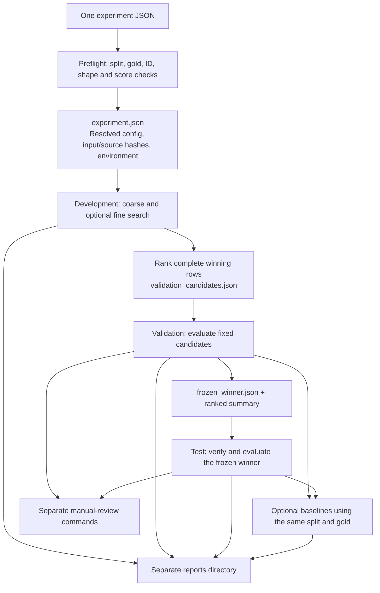

# Running and reproducing experiments

The redesigned pipeline uses one JSON file per experiment. That file defines the gold and chunk files, all three split-ID files, representation matrices and score direction, selector settings, optional refinement, candidate limit, baseline seeds, and output root. Stages derive their paths from that root, so there are no downstream configuration paths to update by hand.

## Everyday commands

Run from the repository root with the existing environment:

```bash
.venv/bin/python -m scripts.run_experiment --config configs/manual_review_v1.json --stage check
.venv/bin/python -m scripts.run_experiment --config configs/manual_review_v1.json --confirm-test
```

The second command runs development (coarse and optional fine search), validation, the frozen-winner test, configured baselines, and reports. `--confirm-test` acknowledges that the experimental protocol is fixed before accessing test results. Both shipped configs write into new `reproduced/` directories; they never replace historical outputs.

For the original base protocol, use `configs/base.json`. The revised dataset and split in `manual_review_v1.json` are a different protocol, not a directly comparable replication of the base experiment.

For stage-by-stage work:

```bash
.venv/bin/python -m scripts.run_experiment --config configs/manual_review_v1.json --stage development
.venv/bin/python -m scripts.run_experiment --config configs/manual_review_v1.json --stage validation
.venv/bin/python -m scripts.run_experiment --config configs/manual_review_v1.json --stage test --confirm-test
.venv/bin/python -m scripts.report_experiment --config configs/manual_review_v1.json
```

Completed stages cannot be overwritten. To run a new experiment, copy the config and change `name` and `output_dir`. The root manifest rejects continuing a run with a changed configuration, input file, source file, or recorded environment. An interrupted stage is not treated as complete: use a fresh output directory rather than editing the partial results. Reports can be regenerated in their own directory.

## Config conventions

`project_root` is resolved relative to the JSON file. Input and output paths are resolved against that root, not the shell's current working directory. The documented module commands still run from the repository root so Python can find `scripts`.

The two complete configs preserve the existing base and revised-dataset protocols. For a small fixed comparison, replace the `development` object with explicit settings:

```json
{
  "experiments": [
    {"representation": "e5", "method": "top_k", "top_k": 1},
    {"representation": "e5", "method": "top_k_threshold", "top_k": 1, "threshold": 0.84},
    {"representation": "e5", "method": "relative_margin", "top_k": 1, "margin": 0.005}
  ]
}
```

This is a fragment for the `development` field, not a full config. Omit `fine_searches` when no refinement is wanted. Otherwise the same file specifies the coarse sweeps and fine-search bounds/point counts. `fine_search_mode` makes the search protocol explicit: `local` brackets the best coarse point using neighboring values and extends/clips edge intervals; `full_range` samples the complete configured lower/upper range. Both retain the best coarse point and remove duplicates. The base config uses `local`; the revised config uses `full_range`, as verified from its saved 2,129-setting manifest. This distinction was missing from the old interface: the current old runner's local implementation does not reproduce the revised historical fine grid.

Representations are named matrix bundles. Each specifies `matrix`, `question_ids`, `chunk_ids`, and an explicit Boolean `higher_is_better`. Cosine and dot-product scores normally use `true`; Euclidean distances use `false`. All selectors now receive that setting. Model weights are not loaded during a cached-matrix experiment.

`validation_candidate_limit` is a positive integer or `null` (all representation/selector winners). Base keeps five candidates; the revised experiment keeps all twelve. `baselines.enabled` controls reference runs; `random_seeds` and `chunk_order_representation` make random sampling reproducible, including the chunk ordering. `reports` controls automatic report generation.

## Execution and artifact ownership



The pipeline works from frozen inputs. It validates non-overlapping split membership, duplicate and missing IDs, gold evidence references, matrix shape, finite scores, selector parameters, and representation score direction. Extra matrix question rows are allowed: this is how the revised 710-question experiment reuses the original 720-row matrices safely.

Each run saves `experiment.json` with the fully resolved configuration, SHA-256 hashes of all input files and active Python files, and Python/platform/package versions. Each stage writes a completion receipt hashing the downstream manifest/summary/candidate/winner files. Dependent stages reject missing or changed receipts. These are reproducibility checks, not a claim that arbitrary different numerical environments produce bitwise-identical results.

```text
<output_dir>/
  experiment.json
  development/
    coarse/                  # per-setting predictions, evaluations, manifest, summary
    fine/                    # same, only when configured
    summary.jsonl            # ranked complete winner per representation/selector
    validation_candidates.json
    complete.json
  validation/
    frozen_winner.json
    summary.jsonl            # ranked; also used by the test identity check
    ...
  test/
    ...                      # only the frozen configuration
  baselines/
    most_frequent_answer.json
    validation/
    test/
  reports/
    development/             # ranking CSV and PNG
    validation/              # ranking, single-gold result, baseline comparison
    test/
  diagnostics/<split>/<kind>/
  manual_review/<split>/
```

Runner data and presentation data have different owners. Reporting cannot overwrite the runner's ranking CSV because the runner now owns JSONL and reports own CSV/PNG under `reports/`. The reports intentionally have a simpler common layout; historical figure filenames and layouts are not part of the new interface. Experiment predictions, per-question evaluation semantics, aggregate metrics and selection rules are preserved.

## Manual review

Manual-review code lives only under `scripts/manual_review/`:

```bash
.venv/bin/python -m scripts.manual_review.prefilter --config configs/manual_review_v1.json --split validation
.venv/bin/python -m scripts.manual_review.review --config configs/manual_review_v1.json --split validation
```

Both commands resolve the selected winner automatically. There is no hardcoded model, threshold or evaluation filename. Prefiltering emits all four category CSVs, including headers for empty categories, so the reviewer can load a complete set. The `manual_review` config section controls the default split, optional previous-review CSV and local browser port.

The reviewer preserves category descriptions, earlier-decision import followed by resumed-review precedence, evidence-opening commands, autosaving via atomic file replacement, and server cleanup. A copy of the chunk browser lives in the experiment's review directory. Reviews remain separate annotations; they do not silently alter gold data or retune the experiment.

## Optional diagnostics

```bash
.venv/bin/python -m scripts.analyze_experiment --config configs/manual_review_v1.json --kind gold
.venv/bin/python -m scripts.analyze_experiment --config configs/manual_review_v1.json --kind matrices
.venv/bin/python -m scripts.analyze_experiment --config configs/manual_review_v1.json --kind thresholds
```

Diagnostics default to development. Matrix/gold inspection can explicitly select validation or test; threshold search advice is restricted to development. The optional rank/score-separation diagnostic calculations currently require higher-is-better similarity matrices. The experiment runner itself supports both score directions. Diagnostic output is separate from selection and is never automatically used to change a config.

Preflight checks replace the old fixed-720-question integrity and prediction-ID launchers. Failures raise errors and yield a nonzero process status. Matrix preflight checks structure and values, not whether an embedding model mathematically generated a particular matrix; frozen input hashes identify exactly which artifacts were used.

## New representations and data preparation

Cached-matrix reproduction requires no neural model download. To create new matrices, use the separate preparation command:

```bash
.venv/bin/python -m scripts.preparation.representations --config configs/prepare_representations.example.json
```

The example creates TF-IDF artifacts in a new directory and refuses existing output directories. It produces a `representations.json` object to copy into a new experiment config. The preparation config accepts `TF_IDF`, `SENTENCE_BERT`, or `RETRIEVAL_BI_ENCODER` model entries, optional `model_name_or_path`, and `cosine`, `dot`, or `euclidean` similarity. Neural models use the dependencies in the existing full environment; for durable provenance use a preserved local model snapshot as `model_name_or_path`. Model aliases alone are not a permanent guarantee of unchanged upstream weights.

Source chunk creation, annotation, and split generation remain separate preparation decisions. The old `data_splitter.py` was specific to the original grouped-split protocol and is archived rather than presented as the generator for the revised question-level split. Both new experiment configs point to the already-frozen split files. Changing the split means supplying a new set of files and a new output directory.

## What changed, and which scripts became obsolete

Every pre-redesign active script is saved under `old/pre_config_pipeline/scripts/`; the earlier `old/scripts/` archive is retained. There are no compatibility wrappers in the new active tree.

| Old script | New owner / reason |
| --- | --- |
| `run_selector_experiments.py` | `core/pipeline.py` development stage plus `core/search.py`; launched through `run_experiment.py`. |
| `dev_summary_script.py` | Complete-row candidate selection in `core/ranking.py`; reporting in `core/reporting.py`. |
| `run_validation_finalists.py` | Explicit validation stage in `core/pipeline.py`. |
| `run_test_winner.py` | Explicit frozen-winner test stage in `core/pipeline.py`. |
| `experiment_pipeline.py` | Shared I/O in `core/config.py`, loading/prediction/stages in `core/pipeline.py`. |
| `chunk_selector.py` | `core/selection.py`; unused `temperature` argument removed. |
| `mapping_evaluator.py` | `core/evaluation.py`; scientific scoring rules preserved. |
| `check_empty_jsonl_in_predictions.py` | Removed. No replacement wrapper. |
| `check_prediction_ids.py` | Standalone launcher removed; input uniqueness/coverage and generated coverage are checked by the pipeline. Historical question spot checks are not pipeline policy. |
| `embeddings_similarity_integrity_check.py` | Fixed dataset assumptions and launcher removed; config-driven preflight is mandatory. Historical cosine spot-check script remains archived. |
| `analyze_selector_experiments.py` | Separate ranking and advisory interval implementation removed. Search uses a single refinement implementation; common ranking/reporting replace its core role. |
| `analyze_similarity_matrices.py` | Calculation/plot functions retained under `analysis/similarity.py`; config and split supplied by `analyze_experiment.py`. |
| `analyze_threshold_regions.py` | Calculation/plot functions retained under `analysis/thresholds.py`; config and development scope supplied by `analyze_experiment.py`. |
| `analyze_gold.py` | Reporting calculation under `analysis/gold.py`; invoked with an explicit configured split. |
| `evaluate_single_gold_only.py` | Common reports compute the winner's one-gold subset, including empty-subset zero behavior. |
| `visualization/visualize_evaluation_optional.py` | Removed as a run-specific plotting configuration collection. Common reports own the new output layout. |
| `visualization/visualize_validation_results.py` | Common stage reports; no collision with runner output. |
| `prefilter_errors.py` | `manual_review/prefilter.py`, configured winner and split. |
| `manual_error_review_all_groups.py` | `manual_review/review.py`, explicit paths and experiment-local browser. |
| `baselines/freeze_dev_reference.py` | Development-only reference calculation in `core/baselines.py`. |
| `baselines/run_baselines.py` | Config-driven baseline branch in `core/baselines.py`, launched with validation/test stages. |
| `baselines/plot_baselines.py` | Common baseline/system comparison reporting. |
| `baselines/compare_with_system.py` | Common reports automatically select the corresponding system result. |
| `compute_embeddings.py` | Separate config-driven `preparation/representations.py`. |
| `compute_similarity_matrices.py` | Same preparation command creates the selected similarity matrix. |
| `text_embedder.py` | `preparation/text_embedder.py`; used only for new artifacts. |
| `similarity_calculator.py` | `preparation/similarity.py`; used only for new artifacts. |
| `data_splitter.py` | Archived original-protocol preparation utility; frozen split paths are the new runtime interface. |

## Restructuring decisions

The redesign keeps plain functions and small modules rather than introducing a framework. The new boundaries are experiment configuration and input checks, reusable scientific operations, stage policy, reports/diagnostics, manual review, and optional representation preparation.

Compatible observations from the earlier map are implemented: one experiment identity, explicit artifact contracts and owners, centralized ranking, whole winning rows, shared fine-search boundaries, explicit diagnostic scope, nonzero validation failures, score direction, and removal of the compatibility wrapper/unused selector argument. Preparation history and human label revision are still explicit external inputs rather than guessed automatic steps.

Tie ordering, random seed order, chunk ordering, empty-gold scoring, missing-prediction accounting, and validation-before-test selection remain part of the scientific contract. The existing results are preserved under their original paths. New report layouts, config schema, entry-point names and archive organization intentionally replace the old interfaces.

## Verification and dependencies

Run focused tests with:

```bash
.venv/bin/python -m unittest discover -s tests -v
```

`requirements-experiment.txt` lists the numerical and reporting package versions used for verification. The existing environment is preferred for exact reproduction. The original full `requirements.txt` is retained for representation preparation; it includes a platform-specific Torch wheel and is not required for cached-matrix experiments.

See `redesign_verification.md` for the actual regression comparisons and limitations. The previous architecture map under `docs/pipeline-map/` is a dated description of the pre-redesign layout; this document describes the new active pipeline.
