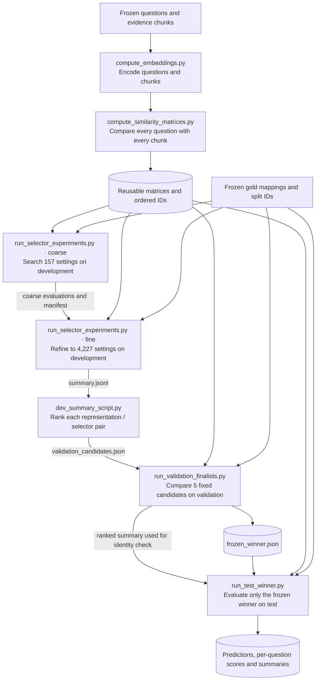
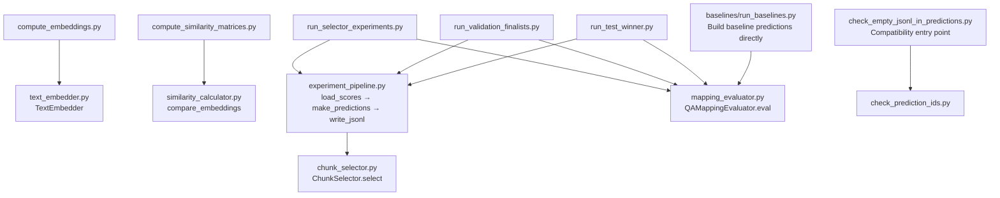
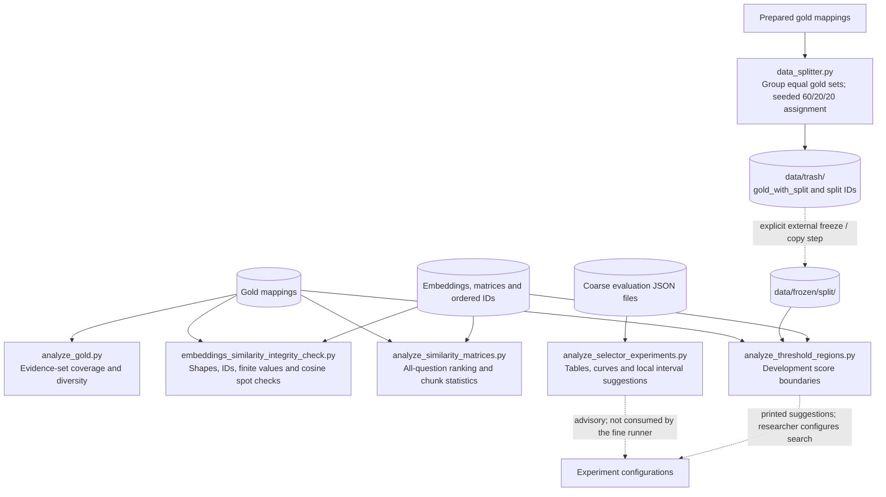
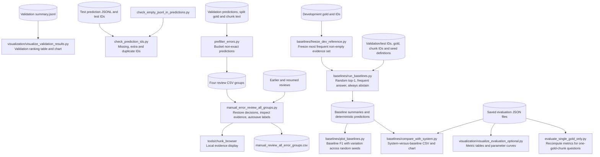

> Historical map of the pre-config-pipeline layout. See [the redesigned pipeline](../experiment_pipeline.md) for the current interface. Source links below point to the archived snapshot.

# Experiment pipeline and script map

Reviewed 3 October 2026 against all 28 active Python files in `scripts/`, after the cleanup. This describes the current implementation, not a proposed restructure. Archived copies in `old/` and historical experiment snapshots are outside the active pipeline. No experiment was rerun for this mapping.

The system retrieves evidence chunks and may abstain. It does not generate answers. Most connections between scripts are files written by one command and read by another. The commands do not automatically launch each other, and `experiment_pipeline.py` is a shared helper module, not an orchestrator.

## 1. Main experiment flow

Solid arrows show saved-data dependencies. Dashed arrows show human decisions or preparation handoffs that are not automated. The stage counts below are from the canonical **base** experiment's saved manifests; they are not fixed limits in the code.

**Why these stages are separate:** embeddings and matrices are expensive reusable inputs; development chooses settings; validation selects among the development finalists; test measures the selected configuration. Plots and error review explain results but do not automatically feed back into the selection chain.

The completed base experiment uses 720 questions, 201 chunks and 432/144/144 development/validation/test IDs. Its frozen winner is E5 with `top_k_threshold`, `top_k=1`, `threshold=0.84`. These values were verified from the repository documentation and saved configurations/manifests.

## 2. Shared code inside a run

Here, arrows mean Python imports/calls, rather than file handoffs. Only local dependencies are shown; NumPy, pandas, scikit-learn, matplotlib and model libraries are omitted.

A runner loads the configured split IDs, selects matrix rows in that ID order, constructs scored chunk predictions, evaluates them against gold, and saves artifacts. `load_scores()` rejects requested IDs absent from a representation. Development loads once per representation; validation caches matrices across candidates; test loads only the winning representation.

### Core behavior to preserve during restructuring

| Component | How it works | Why it matters |
| --- | --- | --- |
| Text representation | TF-IDF fits on chunk texts with 1–3 word n-grams. Sentence-BERT encodes text directly. E5 prefixes questions with `query: ` and chunks with `passage: `. | Representation-specific preprocessing is part of the experiment definition. |
| Similarity | Computes cosine, dot product and Euclidean distance matrices. Current experiment configs select cosine. | Generating a matrix does not mean that matrix participates in the reported experiment. |
| `top_k` | Stable score ranking, take the first k chunks. | Fixed-size retrieval; original chunk order resolves score ties. |
| `threshold` | Keep all ranked chunks meeting the score threshold. | Variable-size evidence sets, including abstention. |
| `top_k_threshold` | Apply the threshold, then cap the remaining list at k. | Combines abstention with a maximum evidence-set size. |
| `relative_margin` | Compare the kth score with the next score, divide the gap by `max(abs(kth score), 1e-12)`, and return the top k only if the margin passes. | Measures separation at the selection boundary; it is not a probability calculation. |
| Per-question evaluation | Compare sets of gold/predicted IDs; compute TP/FP/FN, precision, recall, F1, Jaccard and exact match. | Scores evidence-set agreement, independent of prediction order or score magnitudes. |
| Empty and missing predictions | Empty prediction against empty gold scores perfectly. A missing prediction row is reported as unanswered and excluded from scored rows. | Missing rows and explicit abstention have different meanings. |
| Aggregation | Question means, pooled micro metrics, selection size, coverage and zero-gold abstention measures. | Mean question F1 and micro F1 are different statistics. |
| Ranking | Higher question F1, then exact match, then precision, then fewer selected chunks. | The same priority order governs coarse winners, development candidates and validation selection. |

## 3. Preparation and diagnostic branches

These programs are separate commands. Diagnostics do not gate a runner automatically. Existing frozen inputs are reused for the completed experiment; preparation code is shown to explain their role, not as an instruction to regenerate them.

`analyze_similarity_matrices.py` reads the full matrix question list and gold, including questions outside development. `analyze_threshold_regions.py` explicitly restricts score analysis to development IDs. Those are different analysis scopes and should remain visible in any future design.

The splitter groups questions with identical non-empty gold sets; zero-gold questions each form their own group. It shuffles group IDs with seed 42, stably sorts larger groups first, and assigns each group according to projected split fill. There is no active script here that automatically promotes its `data/trash/` output into the frozen input directory. The separate `manual_review_v1` experiment's question-level split is not implemented by this grouped splitter.

## 4. Reporting, baselines and review

Error prefiltering uses the following order: exact matches are omitted; answerable abstentions; zero-gold retrievals; multiple-gold/single-prediction cases; remaining wrong non-empty predictions. This is an operational review grouping, not a new evaluation metric.

Manual review imports previous wrong-nonempty decisions first, then applies the existing combined review by `(question_id, source_error_group)`, giving resumed decisions precedence. It starts a local server, opens evidence chunks, saves each new decision through temporary-file replacement, and terminates the server when the session exits. Review output is not automatically applied to gold labels or configurations.

Random baselines preserve seed order and report sample standard deviation. The most-frequent baseline is derived from development only, with lexicographic tie-breaking. Baseline test evaluation requires `--confirm-test`. These baselines use the shared evaluator but bypass embedding, similarity and chunk-selection code.

## 5. Complete script inventory

The links point to the current project files. “Standalone” means separately invoked, not automatically called by the previous stage.

### Input preparation and representations

| Script | What it does and how | Inputs → outputs / purpose |
| --- | --- | --- |
| [data_splitter.py](/Users/alexanderdrewes/Desktop/Projects/PythonII_AP_QA_Model/old/pre_config_pipeline/scripts/data_splitter.py) | `group_questions`, `assign_splits`, `write_splits` separate grouping, deterministic allocation and writing. | Prepared gold → enriched gold, split IDs and groups in `data/trash/`. Preparation utility, not the frozen-input publisher. |
| [analyze_gold.py](/Users/alexanderdrewes/Desktop/Projects/PythonII_AP_QA_Model/old/pre_config_pipeline/scripts/analyze_gold.py) | Counts complete gold sets, individual chunks, set sizes and negative questions. | Supplied gold JSONL → console report. Describes annotation coverage and repetition. |
| [compute_embeddings.py](/Users/alexanderdrewes/Desktop/Projects/PythonII_AP_QA_Model/old/pre_config_pipeline/scripts/compute_embeddings.py) | Reads ordered question/chunk texts, runs three embedders and saves aligned arrays. | Frozen texts → question/chunk `.npy`, ID JSON and TF-IDF vectorizer under `artifacts/embeddings/`. |
| [text_embedder.py](/Users/alexanderdrewes/Desktop/Projects/PythonII_AP_QA_Model/old/pre_config_pipeline/scripts/text_embedder.py) | Stateful TF-IDF vectorizer or pretrained neural model; provides `embed_many` and `embed`. | Texts → vectors. Imported by embedding generation; no standalone experiment stage. |
| [compute_similarity_matrices.py](/Users/alexanderdrewes/Desktop/Projects/PythonII_AP_QA_Model/old/pre_config_pipeline/scripts/compute_similarity_matrices.py) | Loops over three representations and three comparison methods; carries IDs forward. | Embeddings → matrices and IDs under `artifacts/similarity_matrices/`. |
| [similarity_calculator.py](/Users/alexanderdrewes/Desktop/Projects/PythonII_AP_QA_Model/old/pre_config_pipeline/scripts/similarity_calculator.py) | Dispatches cosine, dot product or Euclidean comparison. | Two embedding arrays → a question-by-chunk matrix. Imported numerical helper. |

### Diagnostics and search design

| Script | What it does and how | Inputs → outputs / purpose |
| --- | --- | --- |
| [embeddings_similarity_integrity_check.py](/Users/alexanderdrewes/Desktop/Projects/PythonII_AP_QA_Model/old/pre_config_pipeline/scripts/embeddings_similarity_integrity_check.py) | Checks each representation, cross-method ID order and gold references; five seeded cosine spot checks per representation. | Stored embeddings/matrices/gold → console diagnostics. Checks alignment and corruption; does not start or block later commands automatically. |
| [analyze_similarity_matrices.py](/Users/alexanderdrewes/Desktop/Projects/PythonII_AP_QA_Model/old/pre_config_pipeline/scripts/analyze_similarity_matrices.py) | `analyze_question` computes gold ranks/scores; `chunk_statistics` describes columns and top-1 frequency; `summarize_matrix` aggregates records; plotting functions render reports. | Full cosine matrices and gold → per-question/per-chunk CSV, analysis JSON, overview CSV/JSON and PNGs. Explains ranking quality before selection. |
| [analyze_threshold_regions.py](/Users/alexanderdrewes/Desktop/Projects/PythonII_AP_QA_Model/old/pre_config_pipeline/scripts/analyze_threshold_regions.py) | Computes each development question's top, gold and non-gold scores; uses 10th/90th percentile boundaries to suggest seven thresholds. | Development IDs, matrices and gold → threshold CSVs, distributions and printed grids. Supports human search-range choices. |
| [analyze_selector_experiments.py](/Users/alexanderdrewes/Desktop/Projects/PythonII_AP_QA_Model/old/pre_config_pipeline/scripts/analyze_selector_experiments.py) | Loads evaluation files, groups representation/method combinations, ranks settings and plots numeric parameters. | Development run folder → comparison CSV, suggestion JSON, plots and console winners. Suggestions are not an input to `expand_fine_search`. |

### Experiment execution and core logic

| Script | What it does and how | Inputs → outputs / purpose |
| --- | --- | --- |
| [run_selector_experiments.py](/Users/alexanderdrewes/Desktop/Projects/PythonII_AP_QA_Model/old/pre_config_pipeline/scripts/run_selector_experiments.py) | Expands explicit experiments or sweeps. Fine mode verifies coarse provenance, brackets best points, clips/extends intervals, retains coarse winners and deduplicates. | Config + split IDs + matrices + gold; fine also reads coarse run → manifest, predictions/evaluations per setting, summary JSONL. Searches development settings. |
| [experiment_pipeline.py](/Users/alexanderdrewes/Desktop/Projects/PythonII_AP_QA_Model/old/pre_config_pipeline/scripts/experiment_pipeline.py) | `read_json`, `load_scores`, `make_predictions`, `write_jsonl`. Uses selector with ordered split rows. | Shared I/O and prediction functions used by all three runners. It does not itself run the full experiment. |
| [chunk_selector.py](/Users/alexanderdrewes/Desktop/Projects/PythonII_AP_QA_Model/old/pre_config_pipeline/scripts/chunk_selector.py) | Stable ranking plus one of four selection rules. | Score rows and chunk IDs → selected IDs with scores; may return empty lists. |
| [mapping_evaluator.py](/Users/alexanderdrewes/Desktop/Projects/PythonII_AP_QA_Model/old/pre_config_pipeline/scripts/mapping_evaluator.py) | `eval` resolves inputs/scope; `score_question` computes set metrics; `summarize_questions` aggregates. | Gold JSONL and predictions → `summary` plus `per_question`. Shared scientific scoring contract. |
| [dev_summary_script.py](/Users/alexanderdrewes/Desktop/Projects/PythonII_AP_QA_Model/old/pre_config_pipeline/scripts/dev_summary_script.py) | Ranks results, selects representation/selector winners, exports candidates and three plots. | Configured run summaries → candidate JSON, three ranking CSVs and three PNGs. Defines which candidates proceed to validation. |
| [run_validation_finalists.py](/Users/alexanderdrewes/Desktop/Projects/PythonII_AP_QA_Model/old/pre_config_pipeline/scripts/run_validation_finalists.py) | Validates candidate count/uniqueness, caches matrices, evaluates candidates, sorts and exports winner. | Candidates + validation inputs + configured test paths → validation results/ranking and `frozen_winner.json`. Selects and records the final system. |
| [run_test_winner.py](/Users/alexanderdrewes/Desktop/Projects/PythonII_AP_QA_Model/old/pre_config_pipeline/scripts/run_test_winner.py) | Checks winner provenance and identity against the first validation summary row; scores only that setting. | Frozen winner + ranked validation summary + test inputs → manifest, prediction/evaluation files and summary. Final measurement without a search loop. |

### Reporting and manual review

| Script | What it does and how | Inputs → outputs / purpose |
| --- | --- | --- |
| [visualization/visualize_evaluation_optional.py](/Users/alexanderdrewes/Desktop/Projects/PythonII_AP_QA_Model/old/pre_config_pipeline/scripts/visualization/visualize_evaluation_optional.py) | Filters by method and required parameters, derives answerable-only metrics, exports full/best tables and three kinds of comparison plot. | Evaluation JSONs → `comparison/` tables and PNGs. Currently set to relative-margin base validation candidates. |
| [visualization/visualize_validation_results.py](/Users/alexanderdrewes/Desktop/Projects/PythonII_AP_QA_Model/old/pre_config_pipeline/scripts/visualization/visualize_validation_results.py) | Loads and reranks the validation summary, labels settings and plots F1. | Summary JSONL → ranking CSV and PNG. Presentation step; does not freeze a winner. |
| [evaluate_single_gold_only.py](/Users/alexanderdrewes/Desktop/Projects/PythonII_AP_QA_Model/old/pre_config_pipeline/scripts/evaluate_single_gold_only.py) | Filters saved per-question records to exactly one gold chunk and recalculates aggregates. | Base validation/test evaluation JSON → filtered evaluation JSONs. Separates single-evidence performance from multi-evidence cases. |
| [prefilter_errors.py](/Users/alexanderdrewes/Desktop/Projects/PythonII_AP_QA_Model/old/pre_config_pipeline/scripts/prefilter_errors.py) | Joins predictions to split gold and chunk text, then applies ordered category conditions. | Base validation inputs → four review CSV categories. Supplies evidence for human inspection. |
| [manual_error_review_all_groups.py](/Users/alexanderdrewes/Desktop/Projects/PythonII_AP_QA_Model/old/pre_config_pipeline/scripts/manual_error_review_all_groups.py) | `load_reviews`, `review_case`, session coordination, atomic autosaving and browser/server management. | Review group CSVs + earlier decisions + chunks → combined review CSV. Records human explanations. |
| [check_prediction_ids.py](/Users/alexanderdrewes/Desktop/Projects/PythonII_AP_QA_Model/old/pre_config_pipeline/scripts/check_prediction_ids.py) | Compares normalized ID sets and duplicate counts; prints two named question spot checks. | Base test IDs/predictions → console report. Checks coverage, not prediction quality. |
| [check_empty_jsonl_in_predictions.py](/Users/alexanderdrewes/Desktop/Projects/PythonII_AP_QA_Model/old/pre_config_pipeline/scripts/check_empty_jsonl_in_predictions.py) | Imports and calls the renamed checker's `main`. | Compatibility entry point; no separate algorithm. |

### Baseline branch

| Script | What it does and how | Inputs → outputs / purpose |
| --- | --- | --- |
| [baselines/freeze_dev_reference.py](/Users/alexanderdrewes/Desktop/Projects/PythonII_AP_QA_Model/old/pre_config_pipeline/scripts/baselines/freeze_dev_reference.py) | Counts non-empty development gold sets and freezes the most frequent one with deterministic ties. | Development gold/IDs → `dev_reference/most_frequent_answer.json`. Keeps this baseline independent of validation/test labels. |
| [baselines/run_baselines.py](/Users/alexanderdrewes/Desktop/Projects/PythonII_AP_QA_Model/old/pre_config_pipeline/scripts/baselines/run_baselines.py) | Builds seeded random top-1, fixed-answer and empty predictions; uses shared evaluator; aggregates seed runs. | Frozen reference, seed definitions, split IDs/gold/chunk IDs → baseline summaries, random-run scores and deterministic prediction/evaluation files. Provides comparison references. |
| [baselines/plot_baselines.py](/Users/alexanderdrewes/Desktop/Projects/PythonII_AP_QA_Model/old/pre_config_pipeline/scripts/baselines/plot_baselines.py) | Sorts baseline summary rows by F1; draws horizontal bars with random-run standard deviations. | Baseline summary CSV → `baseline_f1_comparison.png`. |
| [baselines/compare_with_system.py](/Users/alexanderdrewes/Desktop/Projects/PythonII_AP_QA_Model/old/pre_config_pipeline/scripts/baselines/compare_with_system.py) | Aligns selected metrics from baseline summaries with a supplied system evaluation; assigns the system zero plotting deviation. | Baseline CSV + system JSON → `system_vs_baselines.csv` and PNG. Reports relative performance; zero deviation is a display convention, not a confidence estimate. |

## 6. The file interfaces holding the pipeline together

| Interface | Producer → consumer | Contract worth preserving |
| --- | --- | --- |
| Embeddings and ID lists | Embedding generation → matrix generation/integrity checks | Arrays and ID lists share ordering. |
| Matrix + question/chunk IDs | Matrix generation → runners and diagnostics | Rows identify questions; columns identify chunks; the three files form one logical input. |
| Split IDs and gold | Frozen data → runners/evaluator/baselines | Explicit split membership controls scoring scope; gold maps each question to required evidence IDs. |
| Prediction JSONL | Runners → checks, review and external inspection | `question_id`, `chunk_ids`, `scores`; scores align with returned IDs. Baseline predictions omit scores. |
| Evaluation JSON | Runners → reporting and fine search | `experiment`, `split`, `summary`, `per_question`; baseline evaluation files contain the evaluator result without the runner metadata wrapper. |
| Run manifest | Runner → fine search/provenance inspection | Records configured paths and experiment settings. Fine search compares split, gold path, ID path and representation configuration with the coarse manifest. |
| Summary JSONL | Development runner → development summary; validation runner → test check and plotting | Development rows are emitted in execution order; validation rows are ranked. Test relies on the first validation row. |
| Candidate JSON | Development summary → validation | Representation, method, nested parameters, development metrics and source-run paths. |
| Frozen-winner JSON | Validation → test | Winner identity, validation metrics/provenance, test gold/IDs, matrix files and test output destination. |
| Review CSV | Prefilter → interactive reviewer | Question/evidence text and pipe-separated chunk IDs; reviewer adds category/code/note and source group. |

## 7. Observations for a future restructure

These are design considerations derived from the current code, not changes made by this mapping.

1. **Separate experiment identity from implementation.** Core runner defaults target `manual_review_v1`; many diagnostics, baseline inputs and review paths target `base`/original frozen data. The base pipeline works through explicit config arguments. A future experiment context could carry the dataset, split, artifact paths and destinations together.
2. **Keep reusable computation separate from stage policy.** Selection, scoring and embedding already have identifiable modules. Coarse/fine search, finalist selection and frozen-winner checks express different experiment rules. They should remain explicit even if orchestration is consolidated.
3. **Make file contracts explicit before moving files.** Most coupling is in JSON keys, path strings, ID order and output names, not imports. Merely reorganizing Python folders will not remove that coupling.
4. **Distinguish diagnostics, search advice and final reporting.** Full-dataset similarity analysis, development-only threshold advice and test reporting have different allowed scopes. Integrity checks currently print PASS/FAIL but do not return a failing process status on a failed check; automated gating would require an explicit behavior change.
5. **Resolve artifact ownership deliberately.** Both the validation runner and its plotting script write `validation_ranking.csv` with different column layouts. Reporting currently owns some outputs inside run folders, while runners protect their entire output directory against reuse.
6. **Centralize ranking only with an agreed semantic contract.** Ranking keys are repeated in runner/reporting code. Development summary still uses pandas `groupby(...).first()`, which can select the first non-null value independently per column rather than preserving an entire row. This was retained for equivalence; changing it deserves a separate decision and test.
7. **Keep advisory and executed fine-search intervals distinguishable.** `analyze_selector_experiments.py` reports adjacent observed points; the runner can extend an edge interval and clips it to configured bounds. The report's suggestions are not the executed search specification.
8. **Treat preparation and provenance as their own concern.** The grouped splitter writes `data/trash/`, not frozen inputs. The 28 active Python scripts do not implement source chunk creation, gold authoring, the follow-up dataset revision/question-level split, or the final publication export process. Those handoffs should not be invented in an automated pipeline diagram.
9. **Keep manual review separate from inference.** It has interactive input, a local server, browser state, CSV restore precedence and atomic saves. Its output informs human decisions; it does not mutate gold automatically.
10. **Preserve score direction and compatibility deliberately.** `ChunkSelector` supports lower-is-better, but the shared prediction helper uses its higher-is-better default. Pointing current runner configs at generated Euclidean distance matrices would therefore not reproduce a correct distance-based ranking without an explicit change. The unused `temperature` parameter and old checker filename remain compatibility concerns.

A possible future grouping to discuss is: preparation, representations, retrieval/evaluation, experiment stages, analysis/reporting, and manual review. This follows existing responsibilities; it is not a proposed framework or an implemented directory migration.

## Evidence and reproducibility of this map

The accompanying `source_inventory.json` records the SHA-256, imports, and function/class line numbers for all 28 active files at the time of review. Stage counts were read from base run manifests. Inputs, outputs and control flow were inspected in the current source and configurations; the map does not claim a new runtime verification of the entire pipeline.
